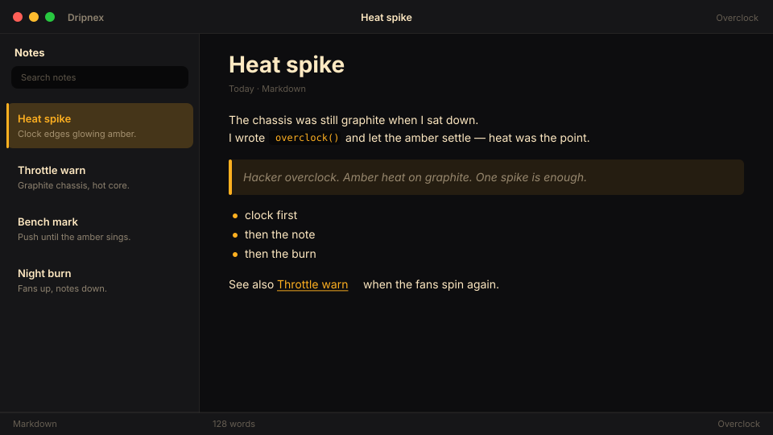

# Overclock

Hacker overclock. Amber heat on graphite.



```
dripnex/theme-overclock
```

## Palette

The chips live in [palette.html](palette.html) — open it in a browser. GitHub won’t paint HTML swatches here, so the hex list is below.

| Name | Token | Color | What it’s for |
| --- | --- | --- | --- |
| Base | `--bg-base` | `#0d0d0f` | Window background |
| Surface | `--bg-surface` | `#161618` | Sidebar and chrome |
| Elevated | `--bg-elevated` | `#222226` | Raised panels |
| Text | `--text-primary` | `#ffe9c2` | Headings and body |
| Muted | `--text-muted` | `#ffe9c2 · rgba(255, 233, 194, 0.52)` | Secondary copy |
| Accent | `--accent` | `#ffb020` | Selection and links |
| Active | `--status-active` | `#ffb020` | Active status |
| Dropped | `--status-dropped` | `#cf6875` | Dropped status |

Pick it for the mood: Hacker overclock. Amber heat on graphite.
